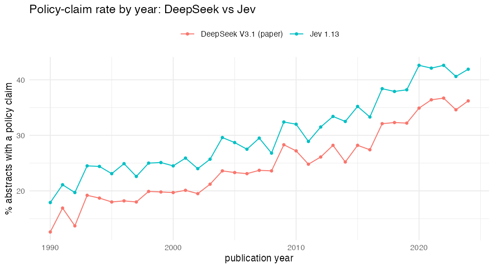

# Jev 1.13 vs DeepSeek V3.1 and human review: policy-claim classification accuracy (R implementation)

Generated by `R/12_jev_accuracy.R`. Jev question set `v1` (hash `1d16b25dcca8`), label rule: P(policy claim) >= 0.5 (`noul`); `choice` = yes/no Choice question.
Kappa CIs are 1,000-resample bootstraps (seed 42), matching 7_concordance.py.

## 1. Development set: design-stratified sample (n=400), reference = DeepSeek

Used only to check the question wording; no human labels here.

| comparison | n | agreement_pct | agreement_ci | kappa | kappa_ci | sensitivity | specificity | ppv | npv | prevalence_ref_pct | prevalence_pred_pct |
|---|---|---|---|---|---|---|---|---|---|---|---|
| dev400: Jev noul vs DeepSeek | 400 | 89.200 | (86.0, 92.2) | 0.758 | (0.686, 0.821) | 0.982 | 0.858 | 0.727 | 0.992 | 27.800 | 37.500 |
| dev400: Jev choice vs DeepSeek | 400 | 89.500 | (86.2, 92.5) | 0.764 | (0.698, 0.825) | 0.991 | 0.858 | 0.728 | 0.996 | 27.800 | 37.800 |

Calibration of Jev's P(policy claim) against the DeepSeek label:

| p_yes_bin | n | observed_rate | mean_p_yes_pct |
|---|---|---|---|
| [0,0.1] | 189 |   0 | 4.600 |
| (0.1,0.3] |  46 |   0 | 19 |
| (0.3,0.5] |  15 | 13.300 | 42 |
| (0.5,0.7] |  31 | 16.100 | 59.200 |
| (0.7,0.9] |  54 | 72.200 | 81.900 |
| (0.9,1] |  65 | 100 | 95.200 |

## 2. Gold standard workbook (n=204 abstracts with human review)

The paper reports DeepSeek vs the adjudicated gold standard: kappa 0.80, sensitivity 76.8%, specificity 98.6% (n=204).

| comparison | n | agreement_pct | agreement_ci | kappa | kappa_ci | sensitivity | specificity | ppv | npv | prevalence_ref_pct | prevalence_pred_pct |
|---|---|---|---|---|---|---|---|---|---|---|---|
| gold: DeepSeek vs adjudicated gold standard | 204 | 92.600 | (89.2, 96.1) | 0.803 | (0.703, 0.891) | 0.956 | 0.918 | 0.768 | 0.986 | 22.100 | 27.500 |
| gold: Jev noul vs adjudicated gold standard | 204 | 92.600 | (88.7, 96.1) | 0.794 | (0.688, 0.886) | 0.889 | 0.937 | 0.800 | 0.968 | 22.100 | 24.500 |
| gold: Jev choice vs adjudicated gold standard | 204 | 92.200 | (88.2, 95.6) | 0.782 | (0.674, 0.877) | 0.889 | 0.931 | 0.784 | 0.967 | 22.100 | 25 |
| gold: DeepSeek vs gold standard excl. non-empirical/truncated | 197 | 92.900 | (89.3, 95.9) | 0.805 | (0.702, 0.891) | 0.952 | 0.923 | 0.769 | 0.986 | 21.300 | 26.400 |
| gold: Jev noul vs gold standard excl. non-empirical/truncated | 197 | 92.900 | (89.3, 95.9) | 0.799 | (0.684, 0.891) | 0.905 | 0.935 | 0.792 | 0.973 | 21.300 | 24.400 |
| gold: Jev choice vs gold standard excl. non-empirical/truncated | 197 | 92.400 | (88.3, 95.9) | 0.786 | (0.667, 0.880) | 0.905 | 0.929 | 0.776 | 0.973 | 21.300 | 24.900 |
| gold: DeepSeek vs reviewer DB (author 1) | 204 | 91.200 | (87.3, 94.6) | 0.765 | (0.657, 0.859) | 0.913 | 0.911 | 0.750 | 0.973 | 22.500 | 27.500 |
| gold: Jev noul vs reviewer DB (author 1) | 204 | 91.200 | (87.3, 95.1) | 0.755 | (0.647, 0.859) | 0.848 | 0.930 | 0.780 | 0.955 | 22.500 | 24.500 |
| gold: Jev choice vs reviewer DB (author 1) | 204 | 90.700 | (86.8, 94.6) | 0.743 | (0.636, 0.847) | 0.848 | 0.924 | 0.765 | 0.954 | 22.500 | 25 |
| gold: DeepSeek vs reviewer EC (author 5) | 204 | 92.600 | (89.2, 96.1) | 0.803 | (0.703, 0.891) | 0.956 | 0.918 | 0.768 | 0.986 | 22.100 | 27.500 |
| gold: Jev noul vs reviewer EC (author 5) | 204 | 92.600 | (88.7, 96.1) | 0.794 | (0.688, 0.886) | 0.889 | 0.937 | 0.800 | 0.968 | 22.100 | 24.500 |
| gold: Jev choice vs reviewer EC (author 5) | 204 | 92.200 | (88.2, 95.6) | 0.782 | (0.674, 0.877) | 0.889 | 0.931 | 0.784 | 0.967 | 22.100 | 25 |
| gold: DeepSeek vs reviewer MW (author 2) | 104 | 95.200 | (90.4, 99.0) | 0.882 | (0.770, 0.974) | 0.931 | 0.960 | 0.900 | 0.973 | 27.900 | 28.800 |
| gold: Jev noul vs reviewer MW (author 2) | 104 | 94.200 | (89.4, 98.1) | 0.853 | (0.719, 0.956) | 0.862 | 0.973 | 0.926 | 0.948 | 27.900 | 26 |
| gold: Jev choice vs reviewer MW (author 2) | 104 | 93.300 | (88.5, 97.1) | 0.831 | (0.692, 0.939) | 0.862 | 0.960 | 0.893 | 0.947 | 27.900 | 26.900 |
| gold: Jev noul vs DeepSeek | 204 | 93.100 | (89.7, 96.1) | 0.822 | (0.731, 0.904) | 0.821 | 0.973 | 0.920 | 0.935 | 27.500 | 24.500 |
| gold: Jev choice vs DeepSeek | 204 | 93.600 | (90.2, 96.6) | 0.835 | (0.746, 0.910) | 0.839 | 0.973 | 0.922 | 0.941 | 27.500 | 25 |

Jev P(policy claim) vs the adjudicated gold standard: AUC = 0.977, Brier score = 0.053 (n=204).

Calibration against the adjudicated gold standard:

| p_yes_bin | n | observed_rate | mean_p_yes_pct |
|---|---|---|---|
| [0,0.1] | 118 |   0 | 4.200 |
| (0.1,0.3] |  28 | 10.700 | 18.900 |
| (0.3,0.5] |   8 |  25 | 39.100 |
| (0.5,0.7] |   8 |  25 | 63 |
| (0.7,0.9] |  21 |  81 | 83.800 |
| (0.9,1] |  21 | 100 | 95.400 |

## 3. Blinded stratified sample (n=400, 1990-2024), reviewers DB and EC

Adjudicated label = DB where DB and EC agree, otherwise DB's double-check (rule from 8_llm_validation.ipynb).

| comparison | n | agreement_pct | agreement_ci | kappa | kappa_ci | sensitivity | specificity | ppv | npv | prevalence_ref_pct | prevalence_pred_pct |
|---|---|---|---|---|---|---|---|---|---|---|---|
| strat400: DeepSeek vs adjudicated manual label | 400 | 86 | (82.5, 89.2) | 0.655 | (0.567, 0.733) | 0.661 | 0.952 | 0.866 | 0.858 | 31.800 | 24.200 |
| strat400: Jev noul vs adjudicated manual label | 400 | 90 | (86.8, 92.8) | 0.765 | (0.685, 0.829) | 0.811 | 0.941 | 0.866 | 0.915 | 31.800 | 29.800 |
| strat400: Jev choice vs adjudicated manual label | 400 | 90.500 | (87.2, 93.2) | 0.778 | (0.703, 0.841) | 0.827 | 0.941 | 0.868 | 0.921 | 31.800 | 30.200 |
| strat400: DeepSeek vs reviewer DB (blinded) | 400 | 83.200 | (79.5, 87.0) | 0.611 | (0.527, 0.693) | 0.603 | 0.965 | 0.907 | 0.809 | 36.500 | 24.200 |
| strat400: Jev noul vs reviewer DB (blinded) | 400 | 87.200 | (83.8, 90.2) | 0.714 | (0.637, 0.782) | 0.733 | 0.953 | 0.899 | 0.861 | 36.500 | 29.800 |
| strat400: Jev choice vs reviewer DB (blinded) | 400 | 87.800 | (84.2, 90.8) | 0.726 | (0.646, 0.798) | 0.747 | 0.953 | 0.901 | 0.867 | 36.500 | 30.200 |
| strat400: DeepSeek vs reviewer EC (blinded) | 400 | 85.800 | (82.2, 89.0) | 0.643 | (0.558, 0.723) | 0.664 | 0.942 | 0.835 | 0.865 | 30.500 | 24.200 |
| strat400: Jev noul vs reviewer EC (blinded) | 400 | 89.200 | (86.0, 92.0) | 0.745 | (0.666, 0.811) | 0.811 | 0.928 | 0.832 | 0.918 | 30.500 | 29.800 |
| strat400: Jev choice vs reviewer EC (blinded) | 400 | 89.800 | (86.5, 92.5) | 0.758 | (0.681, 0.826) | 0.828 | 0.928 | 0.835 | 0.925 | 30.500 | 30.200 |
| strat400: reviewer EC vs reviewer DB (human-human) | 400 | 94 | (91.5, 96.2) | 0.866 | (0.809, 0.914) | 0.836 | 1 | 1 | 0.914 | 36.500 | 30.500 |
| strat400: Jev noul vs DeepSeek | 400 | 93.500 | (91.2, 96.0) | 0.836 | (0.776, 0.897) | 0.979 | 0.921 | 0.798 | 0.993 | 24.200 | 29.800 |

Jev P(policy claim) vs the adjudicated manual label: AUC = 0.956, Brier = 0.076.

Policy-claim rate by period (Supplementary Table 8 style; Wilson 95% CIs; chi-square p across periods: manual p=<0.001, deepseek p=<0.001, jev p=<0.001):

| period | n | manual_rate_pct | manual_95ci | deepseek_rate_pct | deepseek_95ci | jev_rate_pct | jev_95ci |
|---|---|---|---|---|---|---|---|
| 1990-1999 | 114 | 19.300 | (13.1, 27.5) | 13.200 | (8.1, 20.6) | 16.700 | (10.9, 24.6) |
| 2000-2009 | 115 | 27.800 | (20.5, 36.6) | 22.600 | (15.9, 31.1) | 27.800 | (20.5, 36.6) |
| 2010-2019 | 114 | 36 | (27.7, 45.1) | 27.200 | (19.9, 36.0) | 31.600 | (23.8, 40.6) |
| 2020-2024 |  57 | 56.100 | (43.3, 68.2) | 43.900 | (31.8, 56.7) | 56.100 | (43.3, 68.2) |

## 4. Test-retest reliability (repeated Jev runs on the gold-standard abstracts)

DeepSeek reference (paper): kappa 0.90-0.98 across three runs of 200 abstracts at temperature 0.1.

| comparison | n | kappa | agreement_pct | mean_abs_diff_p_yes | max_abs_diff_p_yes | deepseek_kappa_reference |
|---|---|---|---|---|---|---|
| run1 vs run2 | 204 | 1 | 100 | 0.004 | 0.030 | 0.905 |
| run1 vs run3 | 204 | 1 | 100 | 0.005 | 0.040 | 0.930 |
| run2 vs run3 | 204 | 1 | 100 | 0.004 | 0.060 | 0.978 |

## 5. Full corpus: Jev vs DeepSeek

Matched 45,671 of 46,279 Jev-classified abstracts to the derived dataset by DOI (fallback title+journal+year); 608 unmatched.

| comparison | n | agreement_pct | agreement_ci | kappa | kappa_ci | sensitivity | specificity | ppv | npv | prevalence_ref_pct | prevalence_pred_pct |
|---|---|---|---|---|---|---|---|---|---|---|---|
| corpus: Jev noul vs DeepSeek | 45671 | 92.600 | (92.4, 92.8) | 0.819 | (0.814, 0.824) | 0.963 | 0.913 | 0.793 | 0.986 | 25.600 | 31.100 |
| corpus: Jev choice vs DeepSeek | 45671 | 92.300 | (92.0, 92.5) | 0.812 | (0.807, 0.818) | 0.967 | 0.908 | 0.783 | 0.987 | 25.600 | 31.600 |

### By period (Table 1 style, % with policy claim)

| row | DeepSeek 1990-1999 | Jev 1990-1999 | DeepSeek 2000-2009 | Jev 2000-2009 | DeepSeek 2010-2019 | Jev 2010-2019 | DeepSeek 2020-2024 | Jev 2020-2024 | DeepSeek All years | Jev All years |
|---|---|---|---|---|---|---|---|---|---|---|
| All abstracts | 17.700 | 23 | 22.800 | 27.600 | 28.400 | 34.200 | 35.800 | 42 | 25.600 | 31.100 |
| Journal: American Journal of Epidemiology | 8.200 | 10.400 | 8.600 | 9.700 | 11 | 12.400 | 15.600 | 18.500 | 9.900 | 11.600 |
| Journal: American Journal of Preventive Medicine | 31.700 | 41 | 37.200 | 45.100 | 35.900 | 44.900 | 47.200 | 56.700 | 38.200 | 47.100 |
| Journal: American Journal of Public Health | 24.500 | 31.700 | 33.700 | 40.600 | 38.600 | 48.700 | 46.200 | 55.700 | 33.700 | 42 |
| Journal: Epidemiology | 1.300 | 2.300 | 4.200 | 4.600 | 4.500 | 5.900 | 5.100 | 7.700 | 3.700 | 4.800 |
| Journal: European Journal of Epidemiology | 19.500 | 23.500 | 15.300 | 18.100 | 10 | 11.600 | 14.300 | 15.700 | 14.400 | 16.800 |
| Journal: European Journal of Public Health | 27.800 | 33.500 | 33.600 | 40.300 | 40.300 | 45.200 | 45.200 | 51.100 | 38.600 | 44.300 |
| Journal: International Journal of Epidemiology | 15.400 | 19.900 | 20 | 23 | 16.400 | 18.800 | 20 | 22.900 | 17.500 | 20.800 |
| Journal: Journal of Epidemiology and Community Health | 20.800 | 27 | 25.900 | 30.200 | 30.500 | 35.200 | 40.800 | 44.200 | 28.700 | 33.400 |
| Journal: Lancet Public Health |  |  |  |  | 59.100 | 75.600 | 64 | 77.600 | 62.400 | 76.900 |
| Journal: Preventive Medicine | 25.100 | 35.900 | 30.300 | 40.200 | 38.100 | 45.900 | 45.300 | 53.200 | 35.700 | 44.500 |

### By journal

| journal | n | deepseek_rate_pct | jev_rate_pct | agreement_pct | kappa |
|---|---|---|---|---|---|
| Epidemiology | 3094 | 3.700 | 4.800 | 97.700 | 0.718 |
| American Journal of Epidemiology | 7914 | 9.900 | 11.600 | 96.600 | 0.821 |
| European Journal of Epidemiology | 2655 | 14.400 | 16.800 | 96 | 0.850 |
| International Journal of Epidemiology | 4790 | 17.500 | 20.800 | 95 | 0.838 |
| Journal of Epidemiology and Community Health | 4269 | 28.700 | 33.400 | 93.500 | 0.848 |
| American Journal of Public Health | 7801 | 33.700 | 42 | 89.900 | 0.786 |
| Preventive Medicine | 6366 | 35.700 | 44.500 | 89.100 | 0.776 |
| American Journal of Preventive Medicine | 5177 | 38.200 | 47.100 | 88.200 | 0.760 |
| European Journal of Public Health | 3206 | 38.600 | 44.300 | 92.300 | 0.842 |
| Lancet Public Health |  399 | 62.400 | 76.900 | 84.500 | 0.641 |

### Top-15 countries (first author)

| country | n | deepseek_rate_pct | jev_rate_pct | agreement_pct | kappa |
|---|---|---|---|---|---|
| NORWAY |   599 | 12 | 14 | 97 | 0.867 |
| DENMARK |  1019 | 14.100 | 17.300 | 96.100 | 0.852 |
| JAPAN |   535 | 16.300 | 17.900 | 97.200 | 0.901 |
| SWEDEN |  1518 | 17.500 | 20.400 | 96 | 0.872 |
| GERMANY |   698 | 21.200 | 23.900 | 96.400 | 0.898 |
| FINLAND |   789 | 21.300 | 25 | 94.800 | 0.854 |
| NETHERLANDS |  1679 | 22.600 | 27.100 | 94 | 0.839 |
| ITALY |   864 | 23.100 | 27 | 94.800 | 0.862 |
| FRANCE |  1118 | 24.100 | 28 | 94.500 | 0.856 |
| SPAIN |   798 | 25.300 | 29.400 | 95.100 | 0.877 |
| UNITED KINGDOM |  4546 | 25.700 | 30.600 | 92.900 | 0.825 |
| CHINA |   569 | 26.900 | 29.900 | 93.100 | 0.832 |
| UNITED STATES | 23989 | 26.900 | 33.400 | 91.500 | 0.800 |
| CANADA |  1960 | 27.400 | 31.800 | 93 | 0.831 |
| AUSTRALIA |  1338 | 30.300 | 36.800 | 91.300 | 0.807 |

### By study design

| design_combined | n | deepseek_rate_pct | jev_rate_pct | agreement_pct | kappa |
|---|---|---|---|---|---|
| Case-control |  2428 | 9.900 | 11.300 | 97.600 | 0.872 |
| Cohort |  7192 | 20.200 | 23.100 | 95.500 | 0.868 |
| Cross-sectional |  2021 | 36.900 | 43.400 | 92.200 | 0.838 |
| Ecological / Time-series |   516 | 26.600 | 30.800 | 93.400 | 0.839 |
| Experimental |  2063 | 13.800 | 18.400 | 92.400 | 0.721 |
| Other/None | 30644 | 28.100 | 34.500 | 91.600 | 0.806 |
| Qualitative |   122 | 46.700 | 61.500 | 85.200 | 0.709 |
| Quasi-experimental |   685 | 25.700 | 31.700 | 92 | 0.805 |

## 6. Speed and cost

DeepSeek reference (README): ~10 hours and ~$3 for 45,807 abstracts (5 concurrent requests), i.e. ~1.3 abstracts/s.

Jev runs recorded by the classification script:

| run | n | workers | wall_s | abstracts_per_s | latency_p50_ms | latency_p90_ms | cost_usd | tokens_per_abstract |
|---|---|---|---|---|---|---|---|---|
| jev_design400 |   400 |  8 | 17.760 | 22.523 | 303 | 391 | 0.029 | 1694 |
| jev_gold_standard_run1 |   204 |  8 | 8.740 | 23.332 | 296 | 377 | 0.014 | 1685 |
| jev_gold_standard_run2 |   204 |  8 | 9.310 | 21.906 | 291 | 380 | 0.014 | 1685 |
| jev_gold_standard_run3 |   204 |  8 | 8.820 | 23.129 | 292 | 398 | 0.014 | 1685 |
| jev_stratified400 |   400 |  8 | 16.370 | 24.431 | 290 | 383 | 0.028 | 1685 |
| all_abstracts_JEV | 46279 | 16 | 881.820 | 52.481 | 292 | 365 | 3.272 | 1684 |

Concurrency benchmark:

Run 2026-09-19T18:52:25+0000 from this machine via OpenRouter; 100 abstracts per setting (seed 42, source `table/manual_review_by_design_50_each.csv`).
Latency is the client-observed round trip (curl total time) and includes network time. Cost is as reported by OpenRouter (input tokens only, $0.042/M).

| model | workers | n_abstracts | n_failed | wall_seconds | throughput_per_second | latency_ms_p50 | latency_ms_p90 | latency_ms_p99 | latency_ms_mean | input_tokens_mean | cost_usd_total | cost_usd_per_abstract | est_hours_for_corpus | est_cost_usd_for_corpus |
|---|---|---|---|---|---|---|---|---|---|---|---|---|---|---|
| typesafe/jev-1.13 | 1 | 100 | 0 | 19.43 | 5.147 | 339.9 | 425 | 1077.5 | 367.9 | 1712.7 | 0.00719 | 7.19e-05 | 2.47 | 3.3 |
| typesafe/jev-1.13 | 4 | 100 | 0 | 7.4 | 13.521 | 303.3 | 408.8 | 837.9 | 329.3 | 1712.7 | 0.00719 | 7.19e-05 | 0.94 | 3.3 |
| typesafe/jev-1.13 | 8 | 100 | 0 | 4.68 | 21.386 | 307.4 | 449.5 | 935.2 | 357 | 1712.7 | 0.00719 | 7.19e-05 | 0.59 | 3.3 |
| typesafe/jev-1.13 | 16 | 100 | 0 | 5.17 | 19.33 | 402.7 | 1560.6 | 1916.9 | 732.7 | 1712.7 | 0.00719 | 7.19e-05 | 0.66 | 3.3 |

## Extrapolation to the full corpus (n = 45,807)

| model | workers | throughput (abstracts/s) | est. hours | est. cost (USD) |
|---|---|---|---|---|
| deepseek-chat (DeepSeek V3.1) (README) | 5 | 1.27 | 10.0 | 3.00 |
| typesafe/jev-1.13 (best setting here) | 8 | 21.39 | 0.59 | 3.30 |

Speed-up over the DeepSeek run: about 17x at 8 workers. TypeSafe's published limit is 1,200 requests/minute (20/s), so throughput saturates around there.

